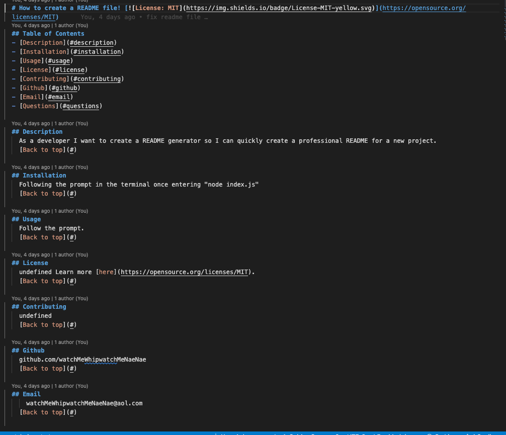

# How to create a README file! 
## Walkthrough Video Guide
- [Video Guide](https://www.kapwing.com/videos/63faef5ff71a89001156ec8e)
## Table of Contents
- [Description](#description)
- [Installation](#installation)
- [Github](#github)
- [Email](#email)
- [Questions](#questions)
  
## Description
    As a developer I want to create a README generator so I can quickly create a professional README for a new project. The code is written in JavaScript using node.js. Function is run by entering node index.js and following the prompt by answering the questions.  
[Back to top](#)
  
## Installation
    Download and install "NPM install"
[Back to top](#)
  
## Screenshot of Terminal

## Screenshot of Example

## Functionality

## Github
    github.com/kevinl206
[Back to top](#)
  
 ## Email
      kevinl206@yahoo.com
[Back to top](#)
  
## Questions
  any additional questions, feel free to reach out to me via [email](mailto:kevinl206@yahoo.com).
  
[Back to top](#)
